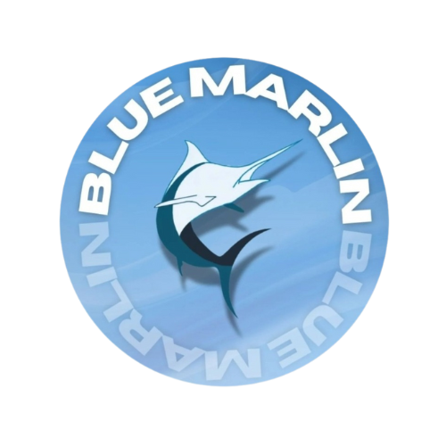

# Blue Marlin Motorsports 🐬 | STEM Racing Brasil

# 💻 Descrição do Projeto
Este repositório contém o código-fonte do site oficial da equipe Blue Marlin Motorsports de STEM Racing | F1 in Schools Brasil. O site foi desenvolvido com o objetivo de apresentar a equipe, seus projetos, patrocínios e atualizações para o público e jurados da competição.

# 🛠 Tecnologias Utilizadas

<ul>
<li>HTML5</li>
 <li>CSS3</li>
 <li>JavaScript</li>
</ul>

